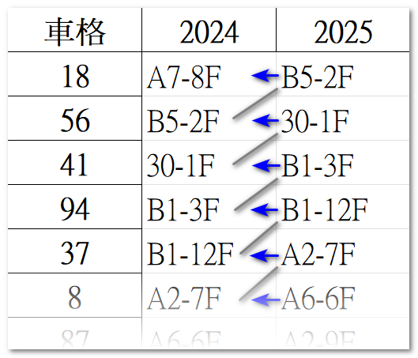

# 社區機車位抽籤程式
## Issues
1. 區權會時間寶貴，而實體抽籤時間冗長，且後續仰賴人工核對登載後才能公告
2. 隨機抽籤方式，結果易形成前車卡後車(詳如下面說明)，最後很多機車無法同步更換車位，每年更換車位皆形成亂象

## Description
經過分析2024與2025年機車格的抽籤結果並重新整理，截取部分結果如下圖，為方便解釋，以下將2024年稱為去年，2025年稱為今年。
<p align="center">
  
</p>

假設從18號車格開始，今年抽中該車格的住戶B5-2F，去年停的是56號車格；56號車格今年則是由住戶30-1F抽中，該戶去年停的是41號車格，以此類推，可以將所有的結果串起來

如圖所見，去年使用18號車格的住戶A7-8F尚未將機車移至今年抽中的車格前，B2-2F住戶會無法移車。而B2-2F未移車前，30-1F也會無法移車。而30-1F未移車前，B1-3F也會無法移車，就這樣前車卡後車，最後大家都動不了，這是每年更換機車位時造成亂象的主要原因。

如果將同一閉環的所有車格抓出來(也就是第一個車格去年的住戶會是最後一個車格今年的住戶)，則此閉環愈大(串了愈多車格)，更換車位時就有可能會卡得愈嚴重。不幸的是，經過數值模擬發現，如果抽籤結果愈接近隨機，就愈有可能發生閉環很長的情況。經過分析，2025年更換車位時，最長的閉環有105個車格(佔所有車格的82%)，如果這105戶沒有同時移車，是沒辦法順利完成更換的。

那為什麼之前還是有順利換完？原因是有些車格去年的機車不在(通常是挑上班日開始更換，大部分機車會離開)，今年的機車就可以順利遞補上閒置的車格。剛交屋時因為閒置的機車格很多，更換機車位不會卡得很嚴重，但隨著大多數住戶入住或將未使用的機車格出租後，閒置的機車格會愈來愈稀缺，導致往後每年更換機車格時會愈來愈困難，只要同一閉環內有些住戶沒有同步更換，後面等著遞補的住戶就會全部被卡死動彈不得。

因此，考量隨機抽籤結果容易發生前車卡後車的超長閉環，本抽籤程式設計的初衷為，透過演算法徹底解決前述所導致每年更換機車位的亂象問題。額外附帶的好處是抽籤流程會在彈指間完成，並直接整理出電子檔即刻公告。大幅縮短區權會中抽機車位佔用的時間，並完全免去後續人工核對與辛苦建檔的過程。

## Functionality
演算法功能設計如下：
1. 仍盡可能亂數隨機更換車格
2. 預留卸任管委優先選擇的停車格，不納入隨機抽籤
3. 排除區權會當日已抽中身障車格的住戶，不納入隨機抽籤
4. 限制至少2個車格，至多5個車格構成一組閉環，閉環長度亦為隨機決定

## Concepts of Algorithm
演算法的核心概念為：
1. 羅列所有參與抽籤的車格和所對應去年使用的住戶
2. 亂數排序車格，成為今年的序列
3. 將此序列隨機取2-5的數量分組，每一組為一個閉環
4. 取出同一組的車格們，以閉環的方式填入該車格今年的住戶(下一順位車格的舊住戶是前一順位車格的新住戶；最後順位車格的新住戶是第一順位車格的舊住戶)
5. 補回預留的車格成為最後一組 <br>

完成！(細節請見程式碼main.py)

## Limitations
演算法仍難以避免有如下限制：
1. 亂數結果會受初始條件(去年的抽籤結果和保留車位)的影響，無法達到每個車格的隨機性完全相同，但不會差很多
2. 目前只有演算法，尚無前端UI，使用門檻較高，待後續管委會或住戶開發更友善的介面，以利往後每年抽籤
3. 演算法會強制更換車格，無法保留隨機抽籤仍有極小的機率可以抽中同一車格的可能性

## Build environment
via [pip](https://pip.pypa.io/en/latest/user_guide/#requirements-files) (directly install the necessary packages)
```
pip install -r requirements.txt
```
via [conda](https://www.anaconda.com/docs/getting-started/working-with-conda/environments) (create an environment named lijie)
```
conda env create -f environment.yml
conda activate lijie
```

## 抽籤流程
1. 確認「初始化設定」資料夾內存在「歷年機車位(戶號).xlsx」與「預留車格(戶號).txt」兩檔，且前者包含去年的記錄
2. 編輯「預留車格(戶號).txt」，身障車格待區權會現場抽籤結果出爐再填入，每行格式為「車格編號: 戶號」或「車格編號: 門牌」
3. 執行程式
   ```
   python main.py
   ```
4. 程式會自動建立「抽籤結果」資料夾，並輸出抽籤結果，包含四個檔案(假設為2026年抽籤)：
   > 2026抽籤結果(戶號).xlsx <br>
   > 2026抽籤結果(門牌).xlsx <br>
   > 歷年機車位(戶號).xlsx <br>
   > 歷年機車位(門牌).xlsx <br>
5. 將抽籤結果置於雲端資料夾公告

- (戶號)的結果會將每戶以戶型代號表示，如A1-2F, B7-8F, A5-10F <br>
- (門牌)的結果會將每戶以門牌號碼表示，如28號7樓之1，會表示為28-7-1 <br>
- 店面戶均會使用門牌表示，若門牌為22號，(戶號)中會顯示為22-1F，(門牌)中會顯示為22-1 <br>
- "歷年機車位(戶號).xlsx"檔案會新增今年的抽籤結果，明年抽籤前要先放入「初始化設定」資料夾
- "2026抽籤結果(戶號).xlsx"檔案內包含兩個sheets：依車格排序、依組別排序。需要同時更換的車格會被分在同一組中


## 溫馨提醒
本程式已盡可能考慮所有可能發生的情況避免出錯，也模擬過多次抽籤並做sanity check並無發現異狀，但仍難以確保任何初始條件下皆可正常運作，若住戶對於抽籤結果有疑慮，或發現異常狀況，請第一時間向管委會反應。